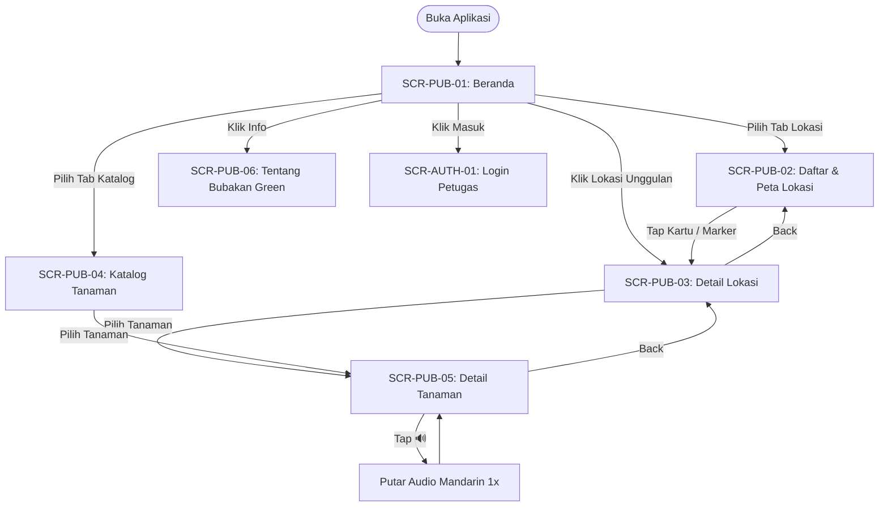
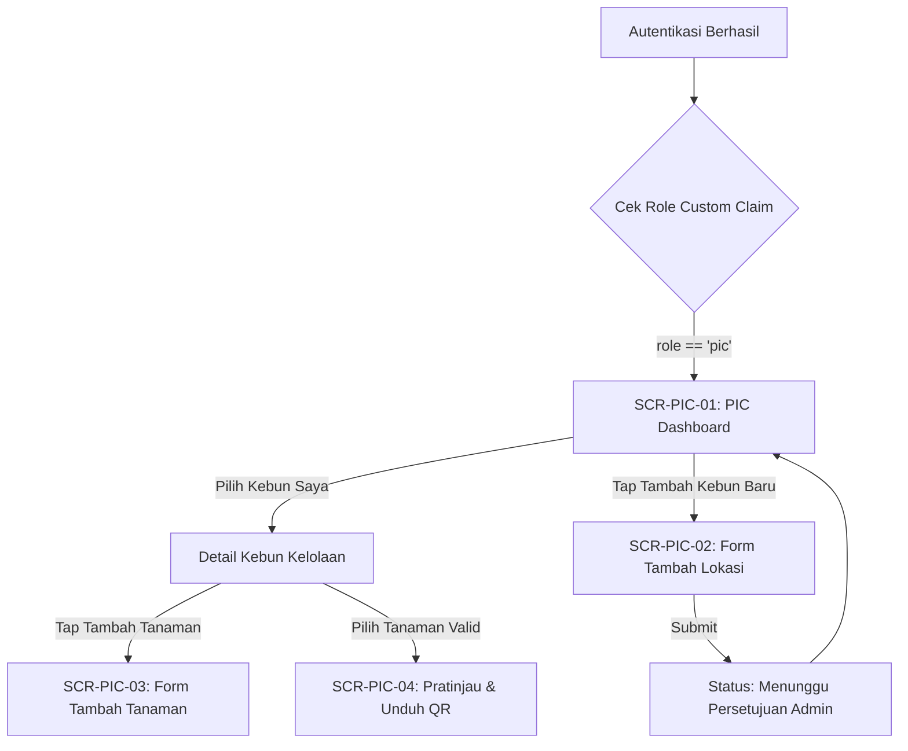
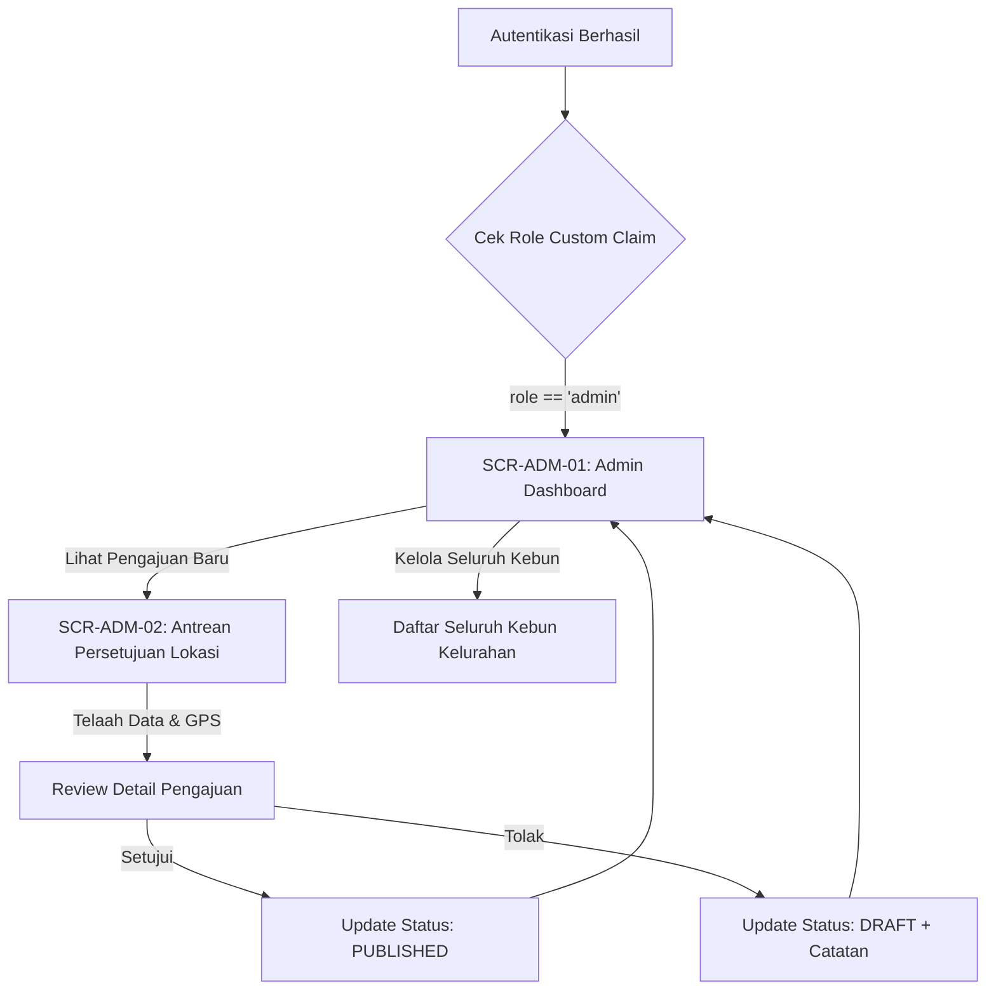
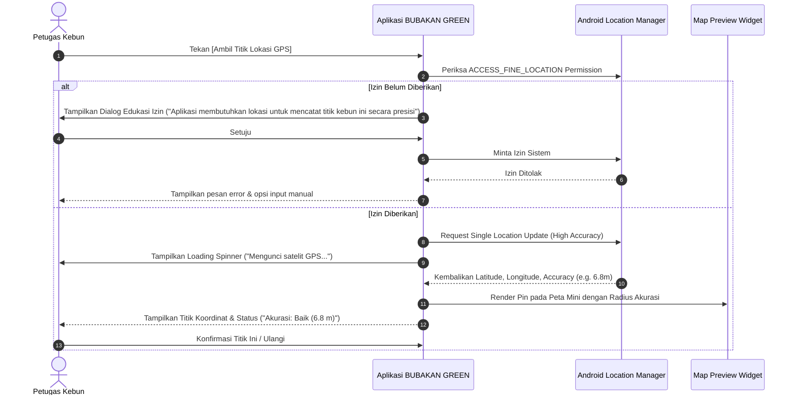
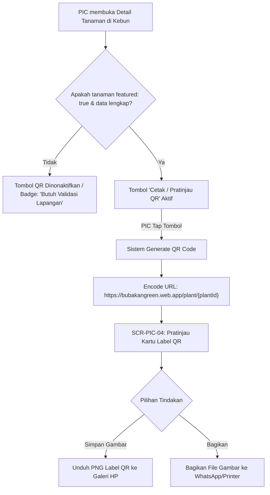
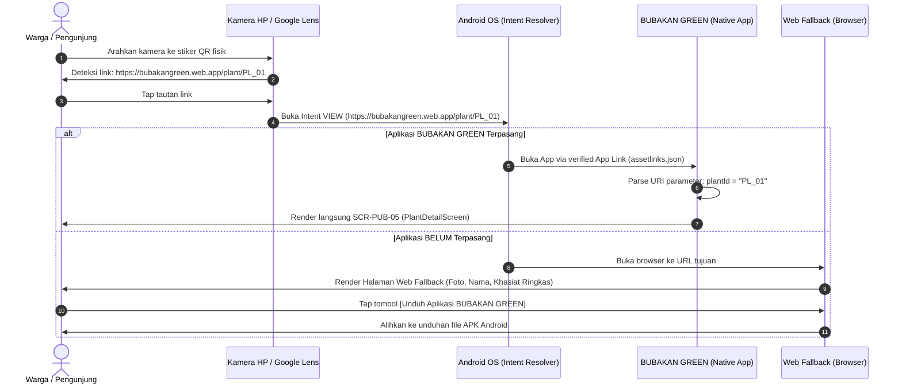

# PHASE 1 IMPLEMENTATION PLAN — BUBAKAN GREEN

**Sistem Informasi Urban Farming & Taman Toga**  
**Kelurahan Bubakan, Kecamatan Mijen, Kota Semarang**  
**Document:** `docs/phase-1/PHASE_1_IMPLEMENTATION_PLAN.md`  
**Date:** 2026-09-23  
**Status:** DRAFT — AWAITING PRODUCT OWNER APPROVAL (`ACC PHASE 1`)  

---

## 1. Phase Objective

The objective of Phase 1 is to translate the approved Phase 0 requirements and architectural constraints into an unambiguous, minimal, accessible, and production-implementable UX/UI specification for **BUBAKAN GREEN**.

This phase defines the Information Architecture, User Flows, Screen Responsibilities, Design System Tokens, UI Components, Edge States (Empty, Loading, Error, Offline), Permission Lifecycles, and Web Fallback Experience without writing production application code.

---

## 2. UX Principles

1. **Location-First Contextual Hierarchy:**  
   Plant information is grounded in real physical spaces (`Location → Plants in Location → Plant Detail`). A location is a primary community asset, not a secondary tag.
2. **Zero-Barrier Public Experience:**  
   The general public, community residents, and garden visitors must never encounter login walls, account registration gates, or invasive permission prompts for browsing, searching, or scanning QR codes.
3. **Intentional & Contextual Interaction:**  
   High-consequence or sensor-dependent actions (GPS coordinate acquisition, audio playback, camera launching) must be strictly user-triggered. No autoplaying audio, no background tracking, no continuous location pinging.
4. **Community Dignity & Local Identity:**  
   Visual and textual identity belongs unconditionally to **Kelurahan Bubakan**. Clean, approachable, readable Indonesian typography suitable for all demographic age groups. No student/KKN branding.
5. **Anti-Slop Restraint:**  
   Every component, screen, and interaction must answer a concrete functional need. No decorative carousels, no gamified badges, no bloated bottom tabs, and no speculative features.
6. **Graceful Degradation Under Real Field Conditions:**  
   The UI is architected for intermittent garden cellular connectivity, low-tier Android hardware, offline cache presentation, and zero-data empty states.

---

## 3. Information Architecture (IA)

### 3.1 Mental Model

```
KELURAHAN BUBAKAN (Ecosystem)
       │
       ▼
   LOCATIONS (Urban Farming / Taman Toga)
       │  [Featured vs Regular]
       │  [Physical GPS Pin & RW]
       │
       ▼
PLANTS IN LOCATION (Botanical Inventory)
       │  [Featured vs Regular]
       │
       ▼
  PLANT DETAIL (Knowledge Card)
       ├── Identitas (Nama Indo, Latin, Hanzi, Pinyin)
       ├── Audio Pelafalan Mandarin [🔊 User-Triggered]
       ├── Manfaat & Khasiat Herbal
       ├── Cara Penanaman & Perawatan
       └── Tautan Fisik [QR Code / App Link]
```

### 3.2 Structural Tree

```
BUBAKAN GREEN (Mobile App)
│
├── [TAB 1] BERANDA (Home)
│    ├── Header Kelurahan & Identitas Produk
│    ├── Banner Lokasi Unggulan (Urban Farming Kelurahan & Taman Toga RW 03)
│    ├── Akses Cepat Kategori (Urban Farming | Taman Toga)
│    └── Cuplikan Tentang Bubakan Green
│
├── [TAB 2] JELAJAHI LOKASI (Locations Directory & Map)
│    ├── Filter Chip: [Semua | Urban Farming | Taman Toga]
│    ├── Segmented View Switch: [Daftar List | Peta Interaktif]
│    │    ├── List View: Kartu Lokasi (Nama, RW, Tipe, Foto, Jumlah Tanaman)
│    │    └── Map View: Pin Lokasi, Popup Preview, Tap to Detail
│    └── Lokasi Detail Screen
│         ├── Info Geografis, Alamat, RW, PIC
│         ├── Peta Statis Mini & Koordinat (Status Verifikasi)
│         └── Daftar Koleksi Tanaman di Lokasi Ini
│
├── [TAB 3] KATALOG TANAMAN (Global Plant Catalog & Search)
│    ├── Search Field (Pencarian Nama Tanaman / Latin)
│    ├── Filter Kategori Manfaat / Tipe Kebun
│    └── Grid / List Tanaman → Menuju Plant Detail Screen
│
├── [GLOBAL OVERLAY / TOP BAR]
│    ├── Ikon "Tentang" → Tentang Bubakan Green Modal / Screen
│    └── Ikon "Kunci/Masuk" → Login Petugas (PIC & Admin Kelurahan)
│
└── [PORTAL PETUGAS / AUTHENTICATED] (Dynamic Role Adaptive)
     ├── PIC DASHBOARD (Petugas Lapangan)
     │    ├── Daftar Lokasi yang Dikelola (My Locations)
     │    ├── Form Tambah / Edit Lokasi (+ Single-Shot GPS Capture)
     │    ├── Form Tambah / Edit Tanaman (+ Kompresi Foto)
     │    └── Pratinjau & Unduh QR Tanaman (Hanya Tanaman Validasi)
     │
     └── ADMIN DASHBOARD (Pemerintah Kelurahan)
          ├── Antrean Persetujuan Lokasi Baru (Location Approval Queue)
          ├── Manajemen Penugasan PIC per Lokasi
          └── Ringkasan Master Data Kelurahan
```

---

## 4. User Types & Personas

| User Type | Role Profile | Tech Literacy | Primary Context | Core Needs in App |
|:---|:---|:---|:---|:---|
| **Warga / Pengunjung Publik** | Warga RW Bubakan, pelajar, wisatawan edukasi, kader PKK | Rendah – Menengah (pengguna WA, YouTube, Kamera) | Berada di kebun melihat fisik tanaman atau di rumah mencari info tanaman toga | Scan QR lewat kamera hp, baca khasiat tanaman, dengar pelafalan Mandarin, cari letak kebun |
| **PIC / Pengelola Kebun** | Kader tani kelurahan, pengurus RT/RW 03, penanggung jawab kebun | Menengah (terbiasa input form smartphone standar) | Di lapangan kebun menginventarisasi tanaman dan mencatat lokasi baru | Input data tanaman & foto, catat titik GPS kebun, cetak QR code tanaman valid |
| **Admin Kelurahan** | Perangkat Kelurahan Bubakan / Seksi Pembangunan & Lingkungan | Menengah | Kantor kelurahan / smartphone dinas | Menyetujui pendaftaran kebun baru dari PIC, memantau persebaran kebun, mengelola akun PIC |

---

## 5. User Journeys

### Journey 1: Warga Fisik Menemukan Tanaman di Kebun (QR On-Site)
1. Warga melihat plang tanaman di Taman Toga RW 03 dengan stiker QR code.
2. Warga membuka kamera ponsel / Google Lens bawaan, mengarahkan ke QR.
3. Notifikasi App Link muncul: `bubakangreen.web.app/plant/PLANT_03_JAHE`.
4. Jika aplikasi BUBAKAN GREEN terpasang → Aplikasi terbuka langsung di `PlantDetailScreen`.
5. Jika aplikasi belum terpasang → Halaman Web Fallback terbuka di browser, menampilkan foto tanaman, nama, khasiat ringkas, dan tombol "Unduh Aplikasi BUBAKAN GREEN".

### Journey 2: Pengunjung Belajar Pelafalan Mandarin Tanaman
1. Pengunjung membuka aplikasi BUBAKAN GREEN, masuk ke tab "Katalog Tanaman".
2. Mengetik nama tanaman atau memilih dari daftar.
3. Di `PlantDetailScreen`, pengunjung melihat karakter Hanzi dan Pinyin.
4. Pengunjung menekan tombol `[ 🔊 ]`.
5. Suara audio melafalkan nama tanaman dalam bahasa Mandarin satu kali kemudian berhenti.

### Journey 3: PIC Mendaftarkan Titik Kebun Urban Farming Baru
1. PIC login dengan email & password terdaftar.
2. Di PIC Dashboard, menekan tombol `[+ Tambah Lokasi Baru]`.
3. Mengisi nama kebun, memilih kategori "Urban Farming", memilih nomor RW.
4. Berdiri di tengah lahan kebun, menekan tombol `[ Ambil Titik Lokasi GPS ]`.
5. Sistem meminta izin lokasi (dialog izin Android standar), lalu mengakuisisi titik koordinat (akurasi <10m).
6. Titik koordinat dan peta preview mini muncul. PIC mengonfirmasi dan mengunggah foto gerbang/lahan kebun.
7. Menekan `[ Ajukan Lokasi ]`. Status lokasi tercatat sebagai `PENDING_APPROVAL` menunggu verifikasi Admin Kelurahan.

---

## 6. Navigation Model

### 6.1 Bottom Navigation Architecture (Strict 3 Tabs)

To avoid cognitive overload and follow Android Material 3 ergonomics:

```
┌────────────────────────────────────────────────────────┐
│  BUBAKAN GREEN                    [ℹ️ Info] [🔒 Masuk] │ Top App Bar
├────────────────────────────────────────────────────────┤
│                                                        │
│                   CONTENT AREA                         │
│                                                        │
├────────────────────────────────────────────────────────┤
│   [ 🏠 Beranda ]    [ 📍 Lokasi ]    [ 🌿 Katalog ]    │ Bottom Navigation
└────────────────────────────────────────────────────────┘
```

1. **Tab 1 — Beranda (`Home`):**  
   Highlight lokasi unggulan, pengantar program, quick category filters.
2. **Tab 2 — Lokasi (`Locations`):**  
   Pusat eksplorasi kebun. Dilengkapi segmented switch: **Daftar** (Cards) dan **Peta** (Full Interactive Map).
3. **Tab 3 — Katalog (`Catalog`):**  
   Pencarian cepat seluruh tanaman toga dan tanaman pangan di seluruh Bubakan.

### 6.2 Top Bar Actions
- **Left:** Brand typography & Kelurahan Coat of Arms / App Icon.
- **Right (Public):** `[ℹ️ Info]` (Membuka Tentang Bubakan Green) dan `[🔒 Masuk]` (Membuka login PIC/Admin).
- **Right (Authenticated):** `[Avatar / Role Badge: "PIC RW 03"]` (Membuka Dashboard Petugas & Logout).

### 6.3 Backstack & Hierarchical Navigation
- `PlantDetailScreen` dapat diakses dari:
  - `LocationDetailScreen` → Back button kembali ke `LocationDetailScreen`.
  - `PlantCatalogScreen` → Back button kembali ke `PlantCatalogScreen`.
  - External App Link (QR) → Back button kembali ke `HomeScreen` (Root).

---

## 7. Screen Inventory & Priority Classification

| Screen ID | Screen Name | Role | Priority | Purpose & Core Responsibility | Entry Point | Exit Point | MVP Status |
|:---|:---|:---|:---|:---|:---|:---|:---|
| **SCR-PUB-01** | `HomeScreen` | Public | **P0** | Menampilkan identitas resmi Bubakan Green, kartu sorotan lokasi unggulan, dan akses cepat. | App launch | Tab Lokasi, Tab Katalog, Detail Lokasi, Login | **MVP MUST HAVE** |
| **SCR-PUB-02** | `LocationListMapScreen` | Public | **P0** | Menampilkan seluruh lokasi kebun dalam bentuk list kartu atau peta interaktif via segmented switch. | Tab Lokasi | SCR-PUB-03 (LocationDetail) | **MVP MUST HAVE** |
| **SCR-PUB-03** | `LocationDetailScreen` | Public | **P0** | Menampilkan profil lengkap lokasi (nama, RW, tipe, foto, deskripsi, peta mini) dan daftar tanaman di lokasi tsb. | Kartu Lokasi di Home/List/Map | SCR-PUB-05 (PlantDetail), Tab Lokasi | **MVP MUST HAVE** |
| **SCR-PUB-04** | `PlantCatalogScreen` | Public | **P0** | Daftar pencarian seluruh tanaman terdata dengan input keyword dan filter kategori. | Tab Katalog | SCR-PUB-05 (PlantDetail) | **MVP MUST HAVE** |
| **SCR-PUB-05** | `PlantDetailScreen` | Public | **P0** | Kartu pengetahuan botani lengkap: Nama Indo, Latin, Hanzi, Pinyin, tombol audio Mandarin [🔊], foto, khasiat, perawatan. | List Tanaman di Lokasi / Katalog / App Link QR | Back to caller / Home | **MVP MUST HAVE** |
| **SCR-PUB-06** | `AboutScreen` | Public | **P1** | Informasi resmi profil program Urban Farming & Taman Toga Kelurahan Bubakan, panduan QR, dan versi app. | Ikon Info di Top Bar | Back | **MVP SHOULD HAVE** |
| **SCR-AUTH-01**| `LoginScreen` | Auth | **P0** | Autentikasi email & kata sandi bagi PIC kebun dan Admin Kelurahan. | Ikon Gembok di Top Bar | Dashboard PIC / Dashboard Admin | **MVP MUST HAVE** |
| **SCR-PIC-01** | `PicDashboardScreen` | PIC | **P0** | Pusat kendali petugas lapangan: menampilkan daftar kebun binaan, ringkasan tanaman, dan aksi cepat penambahan. | Login sukses (PIC) | Form Lokasi, Form Tanaman, Logout | **MVP MUST HAVE** |
| **SCR-PIC-02** | `LocationFormScreen` | PIC / Adm | **P0** | Form pendaftaran/pembaruan kebun: input nama, tipe, RW, deskripsi, foto kebun, dan tombol akuisisi GPS tunggal. | Dashboard PIC / Admin | Dashboard PIC | **MVP MUST HAVE** |
| **SCR-PIC-03** | `PlantFormScreen` | PIC / Adm | **P0** | Form input data tanaman di lokasi: nama Indonesia, Latin, Hanzi, Pinyin, khasiat, cara tanam, upload foto. | Detail Lokasi PIC / Dashboard | Detail Lokasi PIC | **MVP MUST HAVE** |
| **SCR-PIC-04** | `PlantQrPreviewScreen` | PIC / Adm | **P0** | Pratinjau QR Code tanaman yang sudah divalidasi, unduh gambar stiker label untuk dicetak di lapangan. | Detail Tanaman di PIC Dashboard | Dashboard PIC | **MVP MUST HAVE** |
| **SCR-ADM-01** | `AdminDashboardScreen`| Admin | **P1** | Ringkasan kelurahan: daftar persetujuan lokasi tertunda, daftar master kebun & PIC. | Login sukses (Admin) | Antrean Approval, Logout | **MVP SHOULD HAVE** |
| **SCR-ADM-02** | `LocationApprovalScreen`| Admin | **P1** | Telaah lokasi baru dari PIC (evaluasi titik GPS, foto, nama, deskripsi) -> Setujui / Tolak dengan catatan. | Dashboard Admin | Dashboard Admin | **MVP SHOULD HAVE** |
| **SCR-ADM-03** | `PicAssignmentModal` | Admin | **P2** | Modal penugasan PIC ke lokasi kebun tertentu. | Admin Dashboard | Admin Dashboard | **COULD HAVE (P2)** |

*Total Screen Inventory:* 10 P0 Screens, 3 P1 Screens, 1 P2 Modal.  
*Strict Scope Compliance:* No speculative screens, no duplicate layouts.

---

## 8. Screen Priority Rationalization

- **P0 (Must Have — 10 screens):** Essential to complete the 12 core MVP capabilities (Public discovery, location hierarchy, botanical detail with audio, QR deep linking, single-shot GPS capture, and PIC CRUD).
- **P1 (Should Have — 3 screens):** High-value administrative control and public governance context (`AboutScreen`, `AdminDashboard`, `LocationApproval`). If Admin screens are temporarily handled via Firebase Console during early alpha, the core product still works, but including them in Compose ensures sustainability.
- **P2 (Could Have — 1 modal):** Operational convenience (`PicAssignmentModal`). In early MVP, PIC assignment can be configured via Firebase Custom Claims script.

---

## 9. Screen Responsibilities & Data Contracts

### 9.1 SCR-PUB-01: `HomeScreen`
- **Purpose:** Menyambut warga, memperkenalkan identitas program Bubakan Green, dan memfasilitasi navigasi langsung ke lokasi unggulan.
- **User:** Publik (Anonim).
- **Entry:** Peluncuran aplikasi.
- **Exit:** Ke `LocationDetailScreen` (klik kartu unggulan), `LocationListMapScreen` (klik lihat semua lokasi), `PlantCatalogScreen`, atau `LoginScreen`.
- **Primary Action:** Memilih salah satu lokasi unggulan (Urban Farming Kelurahan atau Taman Toga RW 03).
- **Secondary Action:** Membaca pengantar program kelurahan atau membuka peta.
- **Data Required:**
  - Query Firestore: `locations` where `featured == true` and `status == "PUBLISHED"`.
- **States:** Loading (shimmer card), Content (2 kartu unggulan + ringkasan), Error (banner coba lagi), Offline (pill info cache).
- **Prohibitions:** Tidak boleh ada carousel swipe otomatis (hanya kartu vertikal/horizontal statis teratur), tidak ada banner iklan/KKN.

### 9.2 SCR-PUB-02: `LocationListMapScreen`
- **Purpose:** Menjelajahi seluruh titik Urban Farming dan Taman Toga yang tersebar di wilayah Kelurahan Bubakan melalui daftar maupun visual peta.
- **User:** Publik (Anonim).
- **Entry:** Tab navigasi bawah "Lokasi".
- **Exit:** Ke `LocationDetailScreen`.
- **Primary Action:** Tap kartu lokasi atau tap marker pada peta.
- **Secondary Action:** Mengubah filter chip (`Semua`, `Urban Farming`, `Taman Toga`) atau beralih antara tampilan List dan Peta via Segmented Button.
- **Data Required:**
  - Query Firestore: `locations` where `status == "PUBLISHED"` order by `featured desc, name asc`.
- **States:** Loading list / map, Content list, Empty state ("Belum ada lokasi terdaftar"), Map marker preview bottom sheet.

### 9.3 SCR-PUB-03: `LocationDetailScreen`
- **Purpose:** Menampilkan identitas lengkap satu lokasi kebun fisik beserta seluruh inventaris tanaman yang ditanam di dalamnya.
- **User:** Publik (Anonim) & Petugas.
- **Entry:** Dari `HomeScreen`, `LocationListMapScreen`, atau App Link `/location/{id}`.
- **Exit:** Ke `PlantDetailScreen`, atau tombol Back.
- **Primary Action:** Memilih kartu tanaman untuk membaca informasi detail tanaman.
- **Secondary Action:** Membuka koordinat lokasi ke aplikasi Google Maps eksternal untuk petunjuk arah.
- **Data Required:**
  - Document Firestore: `locations/{locationId}`.
  - Query Firestore: `plants` where `locationId == locationId` and `status == "ACTIVE"`.
- **States:** Loading, Detail terisi, Empty Tanaman ("Belum ada tanaman terdata di lokasi ini"), Offline cached.

### 9.4 SCR-PUB-04: `PlantCatalogScreen`
- **Purpose:** Indeks pencarian terpusat seluruh tanaman toga dan pangan di Kelurahan Bubakan tanpa harus membuka satu per satu lokasi.
- **User:** Publik.
- **Entry:** Tab navigasi bawah "Katalog".
- **Exit:** Ke `PlantDetailScreen`.
- **Primary Action:** Mengetik pada kolom pencarian (search bar) atau memilih kartu tanaman.
- **Data Required:**
  - Query Firestore: `plants` where `status == "ACTIVE"` order by `nameId asc`.
- **States:** Default catalog list, Searching query, Empty search results ("Tanaman tidak ditemukan"), Loading.

### 9.5 SCR-PUB-05: `PlantDetailScreen`
- **Purpose:** Kartu ensiklopedia botani edukatif tanaman herbal/pangan yang memuat nama ilmiah, nama & pelafalan audio Mandarin, serta panduan khasiat.
- **User:** Publik (pengguna umum maupun hasil scan QR lapangan).
- **Entry:** Dari `LocationDetailScreen`, `PlantCatalogScreen`, atau Deep Link QR `/plant/{plantId}`.
- **Exit:** Tombol Back ke caller screen atau Home.
- **Primary Action:** Membaca khasiat tanaman dan menekan tombol audio Mandarin `[ 🔊 ]`.
- **Secondary Action:** Melihat referensi kebun asal tanaman tsb.
- **Data Required:**
  - Document Firestore: `plants/{plantId}`.
  - Document Firestore: `locations/{plant.locationId}` (nama kebun & RW).
- **States:**
  - Audio Idle (ikon speaker normal).
  - Audio Playing (ikon speaker animasi gelombang suara / indikator berhenti).
  - Audio Missing/Error (jika URL audio null, tombol disembunyikan secara bersih).
  - Content Loaded, Offline Cached.

---

## 10. Public User Flow



---

## 11. PIC (Petugas Lapangan) Flow



---

## 12. Admin (Kelurahan) Flow



---

## 13. Location Creation Flow (PIC)

```
1. PIC membuka SCR-PIC-02 (LocationFormScreen)
2. Memilih Tipe Kebun: [Urban Farming] atau [Taman Toga]
3. Mengisi Nama Kebun (contoh: "Taman Toga RW 03")
4. Memilih Wilayah RW (dropdown RW 01 - RW 10 Bubakan)
5. Mengisi Deskripsi ringkas & alamat fisik
6. Berdiri di lokasi fisik -> Menekan tombol [Ambil Titik Lokasi GPS]
   -> Menjalankan GPS Acquisition Sub-flow (lihat Sec 14)
7. Memilih foto utama kebun dari galeri atau kamera ponsel
   -> Otomatis dikompresi di sisi klien sebelum upload (<300KB)
8. Menekan tombol [Kirim Pengajuan Lokasi]
9. Sistem menyimpan data ke Firestore dengan:
   - status: "PENDING_APPROVAL"
   - coordinatesStatus: "PENDING"
   - picUid: auth.currentUser.uid
10. Tampil konfirmasi sukses -> Kembali ke PIC Dashboard
```

---

## 14. GPS Acquisition Flow (Single-Point Capture)



**GPS Rules:**
- Capture bersifat **sekali panggil (single-point fix)**. Setelah koordinat diperoleh, listener lokasi Android langsung dilepas (`stopLocationUpdates()`).
- Tidak ada background service atau geofencing yang berjalan.
- Jika GPS gagal mengunci dalam 15 detik, tampilkan dialog: "Sinyal GPS lemah di area ini. [Coba Lagi] atau [Gunakan Titik Peta Manual]".

---

## 15. Plant Management Flow (PIC)

```
1. PIC memilih Kebun binaannya di PIC Dashboard
2. Menekan tombol [+ Tambah Tanaman]
3. Membuka SCR-PIC-03 (PlantFormScreen)
4. Mengisi Data Wajib:
   - Nama Bahasa Indonesia (wajib)
   - Nama Ilmiah / Latin (opsional / direkomendasikan)
   - Khasiat / Manfaat Tanaman (wajib)
   - Petunjuk Perawatan / Cara Tanam (opsional)
5. Mengisi Data Karakter Mandarin (Opsional, jika sudah tervalidasi):
   - Karakter Hanzi (漢字)
   - Ejaan Pinyin
6. Mengunggah Foto Tanaman:
   - Ambil dari kamera atau galeri
   - Pratinjau foto langsung tampil dengan opsi hapus/ganti
7. Pengaturan Status Unggulan:
   - Toggle: [Jadikan Tanaman Unggulan / Siap QR] (hanya aktif jika data tervalidasi)
8. Simpan Tanaman -> Dokumen tercatat di Firestore `plants`
```

---

## 16. QR Generation Flow



**QR Layout Template:**
- Kotak QR standar resolusi tinggi (512x512px).
- Di atas QR: Logo resmi Kelurahan Bubakan & teks "BUBAKAN GREEN".
- Di bawah QR: Nama Bahasa Indonesia tanaman & Nama Latin.
- Footer: "Pindai menggunakan Kamera HP untuk panduan lengkap & audio Mandarin".

---

## 17. App Link & Deep Navigation Flow



---

## 18. Website Fallback Flow

Halaman web fallback berjalan di hosting Firebase (`bubakangreen.web.app/plant/{plantId}`).

- **Viewport:** Dioptimalkan secara mobile-first (maksimal lebar card 480px, centered di desktop).
- **Header:** Logo resmi Kelurahan Bubakan & Nama "BUBAKAN GREEN".
- **Hero:** Foto asli tanaman bersangkutan.
- **Body:**
  - Nama Indonesia (H1) & Nama Latin (Italic).
  - Nama Mandarin & Pinyin (jika tersedia).
  - Ringkasan Khasiat & Manfaat Tanaman (teks ringkas 1-2 paragraf).
  - Asal Kebun: Nama kebun di Kelurahan Bubakan.
- **Sticky Bottom / Call-To-Action Card:**
  - Banner: *"Ingin mendengar pelafalan audio Mandarin dan panduan perawatan lengkap?"*
  - Tombol Utama (Hijau Bubakan): `[ 📲 Unduh Aplikasi BUBAKAN GREEN (Android) ]`
  - Tautan Bantuan: *"Panduan cara pasang aplikasi"* (accordion sederhana).

---

## 19. Mandarin Audio Interaction Flow

```
Plant Detail Screen Terbuka
       │
       ▼
Periksa Field Dokumen: Apakah `nameMandarin` dan `pinyin` tersedia?
       ├── TIDAK ──> Bagian bahasa Mandarin disembunyikan sama sekali
       │
       └── YA ─────> Render Bagian Bahasa Mandarin:
                     - Karakter Hanzi (Font Noto Sans SC, ukuran 24sp)
                     - Teks Pinyin di atas/bawahnya (ukuran 14sp)
                     - Periksa URL: Apakah `mandarinAudioUrl` valid?
                           ├── TIDAK ──> Ikon speaker disembunyikan
                           └── YA ─────> Tampilkan Tombol Speaker [ 🔊 ]

Pengunjung menekan tombol [ 🔊 ]:
1. State berubah menjadi LOADING:
   - Ikon speaker digantikan CircularProgressIndicator kecil (16dp).
2. Audio Player (ExoPlayer / MediaPlayer Compose) mengunduh/membaca stream URL.
3. State berubah menjadi PLAYING:
   - Ikon speaker berubah menjadi ikon volume bergelombang.
   - Suara audio terdengar jernih (durasi pelafalan ~1-3 detik).
4. Selesai memutar (OnCompletion):
   - State otomatis kembali ke IDLE (ikon [ 🔊 ] standar).
5. Jika terjadi kegagalan jaringan saat memuat audio:
   - State berubah ke ERROR:
   - Tampilkan toast/snackbar ringkas: "Gagal memutar audio. Periksa koneksi internet."
   - State kembali ke IDLE.
```

**Anti-Autoplay Lock:**  
Dilarang keras memicu pemutaran audio saat layar pertama kali dibuka (`LaunchedEffect(Unit) { playAudio() }` adalah pelanggaran standar UX). Audio hanya berbunyi jika tombol disentuh secara sengaja oleh jari pengguna.

---

## 20. Offline & Connectivity UX

1. **Firestore Local Persistence:**  
   Aplikasi memanfaatkan offline persistence bawaan Firestore SDK. Dokumen lokasi dan tanaman yang pernah dibuka sebelumnya akan tersimpan di disk lokal perangkat.
2. **Offline Status Pill (Non-Intrusif):**  
   Ketika perangkat kehilangan sinyal data/WiFi:
   - Bagian atas layar (di bawah Top Bar) menampilkan pill kecil berlatar abu-abu gelap/oranye lembut:  
     `[ 📡 Mode Offline — Menampilkan data terakhir tersimpan ]`
   - Warna tidak boleh mencolok (jangan gunakan warna merah panik).
3. **Offline Behavior pada Aksi Publik:**
   - Membaca data tersimpan: Berjalan lancar tanpa hambatan.
   - Memutar audio Mandarin: Jika file belum pernah di-cache, tombol speaker dinonaktifkan dengan tooltip: "Audio memerlukan koneksi internet".
   - Peta Interaktif: Menampilkan area peta yang sudah ter-cache atau fallback pesan sederhana jika tile belum diunduh.
4. **Offline Behavior pada Aksi Petugas (PIC):**
   - Mengambil GPS: Sensor GPS satelit tetap bekerja tanpa kuota internet. Titik koordinat tetap dapat dikunci.
   - Menyimpan Form: Form disimpan secara lokal di queue Firestore; indikator sinkronisasi menampilkan: "Disimpan di perangkat. Akan disinkronkan saat terhubung internet".

---

## 21. System States (Loading, Error, Empty)

### 21.1 Loading States
- Gunakan **Shimmer Placeholder** berbentuk kartu tanaman/lokasi yang proporsional, bukan spinner layar penuh yang membekukan interaksi.
- Hindari layar putih kosong saat mengambil data awal.

### 21.2 Empty States (Harus Memiliki Alasan Fungsional & Solusi)
| Konteks | Tampilan Empty State | Teks Pesan | Tombol Solusi (CTA) |
|:---|:---|:---|:---|
| **Katalog Tanaman** | Ilustrasi outline pot daun kosong | "Belum ada tanaman yang cocok dengan pencarian Anda." | `[ Reset Pencarian ]` |
| **Lokasi Kebun** | Ilustrasi outline gerbang kebun | "Belum ada lokasi kebun terdaftar." | `[ Muat Ulang ]` |
| **Tanaman di Lokasi** | Ilustrasi tunas kecil | "Belum ada tanaman terdata di kebun ini." | Petugas: `[+ Tambah Tanaman]`, Publik: `[Kembali ke Lokasi]` |
| **Antrean Persetujuan** | Ilustrasi centang hijau rapi | "Semua pengajuan lokasi telah ditinjau." | `[ Refresh ]` |

### 21.3 Error States (Bahasa Manusiawi, Tanpa Istilah Teknis)
- ❌ DILARANG: `Exception: FirebaseNetworkException 503 at line 42`
- ✅ WAJIB: *"Koneksi internet terputus. Pastikan data seluler Anda aktif."* `[ Coba Lagi ]`
- ❌ DILARANG: `GPS Timeout 0x004`
- ✅ WAJIB: *"Satelit GPS membutuhkan waktu lebih lama. Silakan berada di tempat terbuka tanpa naungan atap tebal."* `[ Ulangi Pindai ]`

---

## 22. Search Experience (Katalog Tanaman)

- **Komponen:** SearchBar Material 3 dengan ikon kaca pembesar dan tombol reset `[x]`.
- **Debounce:** Input teks diproses dengan jeda 300ms untuk menghemat pembacaan memori.
- **Search Criteria:** Pencarian mencocokkan kata kunci terhadap:
  1. `nameId` (Nama Indonesia, contoh: "Jahe", "Kencur", "Cabai")
  2. `nameLatin` (Nama Ilmiah, contoh: "Zingiber officinale")
  3. `description` (Manfaat, contoh: "batuk", "lambung", "daya tahan")
- **Pencarian Instan:** Hasil ditampilkan langsung dalam daftar kartu vertikal tanpa memuat ulang layar penuh.

---

## 23. Map Experience (Peta Sebaran Kebun)

1. **Agnostic Container Specification:**  
   UI peta dirancang sebagai kontainer independen yang dapat menerima Map Engine apapun (Google Maps Compose atau osmdroid):
   - **Tampilan Atas:** Filter Chip kategori (`Semua`, `Urban Farming`, `Taman Toga`).
   - **Area Tengah:** Bidang peta interaktif dengan pin penanda lokasi.
   - **Tampilan Bawah:** Kartu Pratinjau Mengambang (Floating Preview Card) saat salah satu pin ditekan.
2. **Visual Marker:**
   - Marker **Urban Farming**: Berwarna Hijau Daun (`#2E7D32`) dengan ikon tanaman sayur.
   - Marker **Taman Toga**: Berwarna Hijau Zaitun/Herbal (`#558B2F`) dengan ikon daun herbal.
   - Marker **Lokasi Unggulan (Featured)**: Memiliki cincin emas/aksen khusus agar langsung terlihat menonjol.
3. **Interaksi Pin:**
   - Tap marker → Peta bergeser halus (animate camera) memusatkan marker.
   - Floating Card muncul di bagian bawah menampilkan: Foto mini kebun, Nama Kebun, Nomor RW, Jumlah Tanaman, dan tombol `[ Buka Profil Kebun ]`.
4. **Pembatasan Batas Geografis (Bounding Box):**
   - Kamera default difokuskan ke wilayah Kelurahan Bubakan, Mijen, Semarang.
   - Zoom level dibatasi antara level 13 hingga 18 (tidak mengizinkan zoom out hingga ke seluruh dunia yang membingungkan).

---

## 24. Permission Lifecycle UX

Aplikasi hanya memerlukan 1 jenis runtime permission: `ACCESS_FINE_LOCATION`.

- **Aturan Emas:** Izin HANYA diminta kepada pengguna dengan peran PIC/Admin saat mereka menekan tombol akuisisi lokasi pada form pendaftaran kebun.
- **Publik:** Tidak pernah diminta izin lokasi sama sekali.
- **Alur Edukasi (Rationale Dialog):**
  Sebelum memanggil dialog OS Android, tampilkan dialog penjelasan singkat:  
  *"BUBAKAN GREEN memerlukan izin lokasi untuk mengunci koordinat GPS kebun ini secara tepat agar warga dapat menemukannya pada peta."*
- **Penolakan Permanen (Don't Ask Again):**  
  Jika izin ditolak permanen oleh PIC, berikan tombol:  
  `[ Buka Pengaturan HP ]` dan alternatif: `[ Masukkan Koordinat Manual ]`.

---

## 25. Accessibility (A11y) Specification

1. **Ukuran Target Sentuh Minimum (Touch Targets):**  
   Semua tombol interaktif, ikon, chip filter, dan tombol speaker Mandarin memiliki luas sentuh fisik minimal **48dp × 48dp** (standar Android Accessibility Guidelines).
2. **Kontras Warna Teks (WCAG 2.1 AA):**  
   - Rasio kontras teks utama terhadap background minimal **4.5 : 1**.
   - Rasio kontras teks besar / judul minimal **3.0 : 1**.
   - Tidak menggunakan abu-abu pudar untuk teks informasi penting.
3. **Informasi Tidak Bergantung pada Warna Saja:**  
   Pembedaan antara Urban Farming dan Taman Toga menggunakan **Kombinasi Warna + Label Teks + Ikon Simbolis**, bukan hanya warna pin.
4. **Dukungan Pembaca Layar (Screen Reader / TalkBack):**  
   - Setiap `IconButton` memiliki `contentDescription` deskriptif dalam Bahasa Indonesia (contoh: `"Putar audio pelafalan bahasa Mandarin"`, `"Kembali ke layar sebelumnya"`, `"Buka peta interaktif"`).
   - Gambar botani memiliki `contentDescription = "Foto tanaman {namaTanaman}"`.
5. **Skalabilitas Huruf (Dynamic Type Scaling):**  
   Semua ukuran teks diatur menggunakan satuan `sp` (scale-independent pixels) yang merespons pengaturan ukuran teks perangkat pengguna lanjut usia.

---

## 26. Design System Foundation (Tokens & Typography)

### 26.1 Color Roles (Palette Alam Kelurahan Bubakan)

| Role Token | Hex Value | Semantic Usage |
|:---|:---|:---|
| `Primary` | `#2D6A4F` | Hijau Hutan Tropis — Warna dominan tombol aksi utama, header aktif, tab aktif. |
| `OnPrimary` | `#FFFFFF` | Teks dan ikon di atas warna Primary. |
| `PrimaryContainer` | `#D8F3DC` | Hijau Mint Lembut — Latar belakang chip aktif, kartu highlight, badge status. |
| `OnPrimaryContainer` | `#081C15` | Teks di atas PrimaryContainer. |
| `Secondary` | `#52796F` | Hijau Sage / Herbal — Elemen sekunder, kategori Taman Toga. |
| `Tertiary` | `#B7E4C7` | Aksen pelengkap, pembatas garis halus. |
| `Background` | `#F8F9FA` | Abu-abu Sangat Bersih — Latar belakang seluruh layar aplikasi. |
| `Surface` | `#FFFFFF` | Putih Murni — Latar belakang kartu, form input, dan bottom sheet. |
| `OnSurface` | `#1B4332` | Hijau Gelap Alami / Hampir Hitam — Warna teks judul dan konten utama (tinggi kontras). |
| `OnSurfaceVariant` | `#5B7065` | Abu-abu Kehijauan — Warna teks sekunder, label tanggal, nama Latin. |
| `Outline` | `#D0DBCE` | Garis tepi kartu dan divider pemisah. |
| `StatusPending` | `#E09F3E` | Oranye Hangat — Badge status menunggu persetujuan admin. |
| `StatusVerified` | `#2D6A4F` | Hijau — Badge status terverifikasi. |
| `Error` | `#BA1A1A` | Merah Peringatan — Teks validasi form dan pesan error kritis. |

### 26.2 Typography Tokens (Material 3 Scale — Font: Plus Jakarta Sans / Roboto)

- **HeadlineLarge (`32sp`, Bold):** Judul utama halaman Beranda ("BUBAKAN GREEN").
- **HeadlineMedium (`24sp`, SemiBold):** Nama tanaman pada `PlantDetailScreen`, judul kartu lokasi.
- **TitleMedium (`16sp`, SemiBold):** Judul seksi, nama tanaman di daftar kartu.
- **BodyLarge (`16sp`, Regular, line-height 24sp):** Teks paragraf deskripsi dan manfaat herbal.
- **BodyMedium (`14sp`, Regular):** Teks sekunder, alamat lokasi, keterangan RW.
- **LabelLarge (`14sp`, Medium):** Label tombol aksi, teks chip filter.
- **LabelSmall (`11sp`, Medium):** Badge status, nomor RW, teks copyright.
- **MandarinChar (`24sp`, Regular, Noto Sans SC):** Khusus rendering karakter Hanzi agar proporsional dan jelas.

### 26.3 Spacing, Elevation & Corner Radii

- **Grid Spacing:** Sistem 8-point grid: `4dp` (xs), `8dp` (sm), `16dp` (md - margin standar), `24dp` (lg), `32dp` (xl).
- **Corner Radii:**
  - Kartu (`Card`): `16dp`
  - Tombol (`Button`): `12dp`
  - Chip Filter: `8dp`
  - Dialog / Bottom Sheet: `24dp` (top corners)
- **Elevation:**
  - Flat Card: `0dp` dengan outline border `1dp` solid `#D0DBCE`.
  - Floating Action / Active Sheet: `3dp` subtle elevation. Tidak menggunakan drop shadow tebal/buram.

---

## 27. Reusable UI Component Inventory

| Component Name | File Proposed | Purpose & Why It Needs To Exist |
|:---|:---|:---|
| **`BubakanTopBar`** | `components/BubakanTopBar.kt` | Header seragam di seluruh app yang menampilkan nama produk resmi dan tombol aksi profil/info. |
| **`LocationCard`** | `components/LocationCard.kt` | Kartu daftar kebun seragam (foto, nama, tipe badge, RW, jumlah tanaman terdata). |
| **`FeaturedLocationBanner`**| `components/FeaturedLocationBanner.kt` | Kartu sorotan khusus di Beranda untuk Urban Farming Kelurahan dan Taman Toga RW 03. |
| **`PlantCard`** | `components/PlantCard.kt` | Kartu ringkas tanaman untuk daftar di katalog dan di dalam profil kebun. |
| **`MandarinSpeakerButton`** | `components/MandarinSpeakerButton.kt` | Tombol interaktif audio pelafalan Mandarin dengan indikator status loading/playing/idle. |
| **`CategoryFilterChip`** | `components/CategoryFilterChip.kt` | Chip horizontal untuk menyaring tipe kebun (Urban Farming vs Taman Toga). |
| **`GpsCaptureWidget`** | `components/GpsCaptureWidget.kt` | Widget form PIC yang memicu penguncian titik satelit, menampilkan akurasi meter, dan mini map pin. |
| **`OfflineStatusBar`** | `components/OfflineStatusBar.kt` | Pill status non-intrusif yang memberitahu pengguna saat data offline ditampilkan. |
| **`StateEmptyView`** | `components/StateEmptyView.kt` | Layout standar empty state dengan ilustrasi garis, teks edukatif, dan tombol aksi pemulihan. |
| **`StateErrorView`** | `components/StateErrorView.kt` | Layout penanganan error jaringan/data dengan tombol coba lagi. |
| **`ShimmerCardPlaceholder`**| `components/ShimmerPlaceholder.kt`| Animasi loading skeleton saat mengambil data Firestore. |

---

## 28. Responsive Web Fallback Specification

- **URL Endpoint:** `https://bubakangreen.web.app/plant/{plantId}`
- **Teknologi:** Single-file HTML5, Vanilla CSS, Vanilla JavaScript (tanpa framework React/Vue/Node build).
- **Ukuran Aset Maksimal:** `< 60 KB` total transfer (memastikan buka instan di koneksi 3G lapangan).
- **Tata Letak (Responsive Layout):**
  - Mobile (<600px): Kartu vertikal satu kolom, margin 16px, sticky CTA bar di bagian bawah.
  - Desktop (>600px): Container kartu terpusat di tengah layar (maksimal lebar 500px) dengan latar belakang hijau mint lembut.
- **Konten Halaman:**
  1. Identitas Kelurahan Bubakan (Logo + Teks).
  2. Foto Tanaman (Aspect Ratio 16:9, responsive ``).
  3. Nama Indonesia, Nama Ilmiah, Nama Mandarin & Pinyin.
  4. Ringkasan Manfaat & Khasiat Tanaman (3-4 butir poin ringkas).
  5. Asal Kebun: Menampilkan nama kebun tempat stiker QR ini dipasang.
  6. CTA Unduh APK: Tombol hijau besar `[ Unduh Aplikasi BUBAKAN GREEN ]` mengarah langsung ke tautan unduh APK di Google Drive resmi Kelurahan.
  7. Petunjuk Instalasi: Teks bantuan 3 langkah mudah menginstal APK Android (Unknown sources).

---

## 29. Usability & Interaction Rules

1. **Aturan Satu Sentuhan Kembali:** Pengguna tidak boleh terjebak dalam loop navigasi. Tombol Back di pojok kiri atas selalu mengembalikan pengguna ke hirarki sebelumnya.
2. **Umpan Balik Instan pada Input Form:** Validasi form (nama kosong, nomor RW belum dipilih) langsung diberi tanda merah di bawah field bersangkutan saat tombol submit ditekan.
3. **Proteksi Kehilangan Data Form:** Jika PIC menekan tombol Back saat mengisi form kebun/tanaman, sistem menampilkan konfirmasi: *"Batalkan pengisian? Data yang belum disimpan akan hilang."*
4. **Tidak Ada Gestur Tersembunyi:** Semua tindakan utama memiliki tombol fisik yang jelas. Tidak mengandalkan gestur rumit seperti long-press, swipe-to-delete tanpa konfirmasi, atau double-tap.

---

## 30. Out of Scope UX (Strict Anti-Slop Enforcement)

Dokumen ini secara mutlak melarang elemen-elemen berikut dirancang atau diimplementasikan:
- ❌ **No Automatic Carousel:** Dilarang menggunakan banner bergeser otomatis yang mengganggu fokus membaca warga.
- ❌ **No Excessive Bottom Tabs:** Dilarang membuat lebih dari 3 tab di navigasi bawah.
- ❌ **No Public Registration:** Dilarang membuat form "Daftar Akun Baru" untuk warga umum.
- ❌ **No Social / Chat / Komentar:** Dilarang menyediakan kolom komentar, tombol like, atau fitur obrolan warga.
- ❌ **No E-Commerce:** Dilarang menambahkan tombol keranjang belanja, harga jual bibit, atau checkout.
- ❌ **No Gamification:** Dilarang menambahkan poin panen, level pekebun, streak login harian, atau badge virtual.
- ❌ **No AI Chatbot:** Dilarang memasang asisten virtual botani atau pemindai kamera bertenaga AI.
- ❌ **No Dark Mode Over-Engineering:** Fokus MVP pada mode terang (Light Mode) yang kontras tinggi dan mudah dibaca di bawah sinar matahari luar ruangan.

---

## 31. Usability Acceptance Criteria (UAC)

| Kode UAC | Kriteria Penerimaan | Metode Pengujian |
|:---|:---|:---|
| **UAC-01** | Warga umum dapat menemukan profil tanaman Jahe/Temulawak dalam waktu < 10 detik dari layar utama. | Usability Testing / Task Completion |
| **UAC-02** | Memindai stiker QR menggunakan kamera smartphone langsung membuka detail tanaman (atau web fallback jika app belum terpasang). | End-to-End Link Verification |
| **UAC-03** | Audio Mandarin hanya bersuara setelah tombol speaker disentuh secara sadar, bersuara tepat 1 kali, dan tidak pernah memutar sendiri saat halaman dibuka. | Interaction Testing |
| **UAC-04** | Petugas kebun dapat mengunci titik koordinat GPS kebun dalam 1 kali tap dengan konfirmasi radius akurasi visual. | Field Device Test |
| **UAC-05** | Form pendaftaran lokasi baru oleh PIC tidak langsung tampil ke publik sebelum disetujui oleh Admin Kelurahan. | Role Access & Firestore Rules Test |
| **UAC-06** | Saat internet dimatikan, halaman yang sudah pernah dibuka tetap menampilkan konten lengkap disertai pill indikator offline yang tenang. | Airplane Mode Cache Verification |
| **UAC-07** | Target sentuh tombol speaker dan tombol aksi form minimal 48dp, dan seluruh kontras warna teks lolos standar WCAG AA. | Accessibility Scanner Audit |
| **UAC-08** | Tidak ada nama tanaman fiktif atau data palsu yang disajikan sebagai fakta di dalam antarmuka. | Content Audit |

---

## 32. Risks & UX Mitigations

| Risiko | Dampak UX | Strategi Mitigasi Desain |
|:---|:---|:---|
| **Sinyal internet lemah di area kebun fisik** | Halaman gagal memuat saat warga memindai QR di lokasi. | Web fallback berukuran super ringan (<60KB); aplikasi Android mengandalkan cache lokal Firestore; sediakan teks offline yang jelas. |
| **Pengguna lansia kesulitan membaca teks** | Informasi khasiat obat tidak terbaca oleh kader/warga senior. | Ukuran body text minimal 16sp dengan kontras tajam (Dark Green `#1B4332` on White); font scaling dinamis (sp). |
| **PIC keliru menekan titik GPS di luar lokasi** | Titik pin kebun salah koordinat di peta. | Tampilkan pratinjau peta mini seketika setelah GPS terkunci dengan penanda nama jalan/lingkungan dan tombol "Ulangi Pindai". |
| **Sideloading APK diblokir oleh keamanan Android** | Pengunjung gagal menginstal aplikasi dari link web fallback. | Sediakan petunjuk visual 3 langkah bergambar sederhana di halaman web tentang cara mengaktifkan "Izinkan instalasi dari sumber ini". |
| **Keputusan Map Provider belum final (ADR-004)** | Layout peta berubah jika engine peta berganti. | Spesifikasi peta dibuat modular (*provider-agnostic*); komponen pin dan floating card terpisah dari map renderer. |

---

## 33. UX Decisions Requiring Approval

1. **Navigasi Bawah 3 Tab (Beranda, Lokasi & Peta, Katalog Tanaman):** Apakah struktur 3 tab terintegrasi ini disetujui sebagai model navigasi final MVP?
2. **Model Segmented Switch pada Layar Lokasi (Daftar vs Peta):** Menggabungkan tampilan daftar kebun dan peta interaktif dalam 1 tab dengan switch pemilih daripada membuat tab peta terpisah.
3. **Penyembunyian Bersih untuk Data Mandarin yang Belum Lengkap:** Jika sebuah tanaman belum memiliki transliterasi Mandarin atau file audio belum direkam di lapangan, komponen tersebut disembunyikan secara rapi (tanpa teks error atau tombol mati).
4. **Pemisahan Keras Fitur QR:** Tombol cetak/unduh label QR hanya diaktifkan untuk tanaman yang berstatus `featured: true` dan lolos validasi lapangan.
