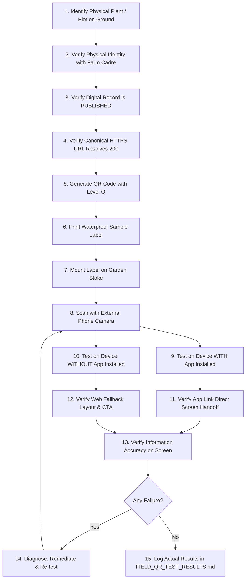

# BUBAKAN GREEN — FIELD QR TEST PROTOCOL & PHYSICAL SPECIFICATION
**Product:** BUBAKAN GREEN  
**Sub-title:** Sistem Informasi Urban Farming & Taman Toga Kelurahan Bubakan  
**Phase:** Phase 5 — QR & Field Integration  
**Governance:** Physical testing cannot be marked PASS prior to execution on real hardware in actual field conditions. Zero fabricated results.  
**Date:** 2026-09-27  
**Revision:** Final Pre-Execution Revision  

---

## 1. QR Version & Encoding Specification

### A. Dynamic QR Versioning Principle
QR matrix version is **NOT** artificially constrained to a rigid fixed version. It is determined dynamically by:
1. **Actual Payload Length**: Canonical HTTPS URL length (typically 42–55 characters for `https://bubakangreen.web.app/plant/<stable-id>`).
2. **Error Correction Level**:
   - **Recommended Default:** **Level Q (25% recovery capability)**. Provides excellent resilience against outdoor scratches, dust, rain spots, and physical weathering.
   - **Fallback Alternative:** **Level M (15% recovery capability)** if smaller physical label footprint is required.
3. **Physical Scanability Priority**:
   $$\textbf{SCANABILITY} > \textbf{PHYSICAL ROBUSTNESS} > \textbf{LOW PAYLOAD DENSITY}$$
   The QR code must be scannable quickly by low-cost Android phone cameras without autofocus hunting.

### B. Quiet Zone Requirement
- A clean, unprinted border (Quiet Zone) of **at least 4 module widths** must surround the entire QR matrix.
- No decorative borders, background graphics, or text may encroach into this quiet zone.

---

## 2. Recommended Physical Print Specification

*Note: The following specification represents the recommended engineering standard. Final procurement must be validated against local printing vendor capabilities and actual garden microclimate conditions.*

| Component | Engineering Recommendation | Rationale / Field Justification |
|---|---|---|
| **Substrate Material** | Outdoor Matte Vinyl or Polypropylene (PP) synthetic paper | Waterproof, tear-resistant, prevents water absorption during garden watering. |
| **Protective Finish** | Matte UV-resistant lamination | Eliminates harsh sunlight glare / specular reflection that impairs camera autofocus; protects against sun fading. |
| **Minimum Physical QR Size**| $\ge 35\text{mm} \times 35\text{mm}$ (Recommended: $45\text{mm} \times 45\text{mm}$) | Allows standard smartphone cameras to acquire focus from $25\text{cm} - 50\text{cm}$ distance without digital zoom. |
| **Total Card Dimensions** | $60\text{mm} \times 90\text{mm}$ (Portrait) or $70\text{mm} \times 70\text{mm}$ (Square) | Provides balanced proportion for plant identity text and scannable code. |
| **Print Contrast** | $\ge 80\%$ contrast (Pure black `#000000` on solid white `#FFFFFF`) | High contrast is vital for recognition under varied outdoor daylight. |
| **Mounting Hardware** | Weatherproof acrylic stake ($3\text{mm}$ thick) or aluminium plant marker | Elevated $30\text{cm} - 60\text{cm}$ above ground level; angled at $30^\circ - 45^\circ$ toward visitor path. |

---

## 3. Label Design Principles (Bubakan-Owned)

1. **Identity & Heritage**:
   - Prominently displays: `BUBAKAN GREEN`
   - Subtitle: `Kelurahan Bubakan, Kecamatan Mijen, Kota Semarang`
   - Do **NOT** invent unauthorized official slogans or unapproved government logos.
2. **Botanical Information Hierarchy**:
   - Common Indonesian Name (Large, Bold, High Contrast).
   - Scientific Latin Name (Medium, Italicized, Botanical Standard).
3. **Citizen Call-to-Action**:
   - Short clear scanning prompt: *"Pindai dengan kamera ponsel untuk khasiat & informasi"*
4. **Visual Contrast**:
   - White background behind QR code.
   - Clean forest green (`#1B4332`) accents outside the quiet zone.
   - Zero decorative watermarks overlapping the data modules.

---

## 4. 15-Step Field Deployment & Testing Workflow

---

## 5. Physical Hardware Verification Protocol

Every physical QR must be tested across the following real-world matrix:
- **Scan Distance Envelope**: Close ($15\text{cm}$), Standard ($30\text{cm}$), Far ($50\text{cm}$).
- **Scan Angle Envelope**: Perpendicular ($0^\circ$), Angled ($30^\circ$ left/right), Overhead ($45^\circ$ top-down).
- **Lighting Conditions**:
  - Full Outdoor Sunlight ($>30,000\text{ lux}$)
  - Shaded Garden Canopy ($1,000 - 3,000\text{ lux}$)
  - Overcast / Late Afternoon ($200 - 500\text{ lux}$)
- **Device Diversity**:
  - Entry-level Android (Fixed-focus or budget sensor)
  - Mid-range Android (Standard autofocus)
  - Flagship Android & iOS
