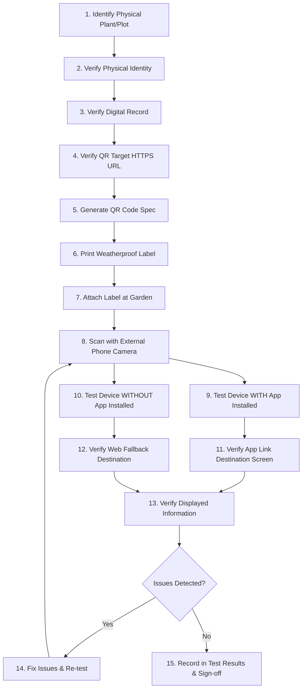

# BUBAKAN GREEN — FIELD QR TEST PROTOCOL
**Product:** BUBAKAN GREEN  
**Sub-title:** Sistem Informasi Urban Farming & Taman Toga Kelurahan Bubakan  
**Phase:** Phase 5 — QR & Field Integration  
**Protocol Version:** 1.0.0  
**Governance:** Field-tested only on physical hardware. No simulated scan may be marked as physical verification.  
**Date:** 2026-09-27  

---

## 1. Scope & Objective

This protocol outlines the mandatory 15-step field integration procedure for deploying physical QR stickers on botanical specimens and garden plots across Kelurahan Bubakan, Kecamatan Mijen, Kota Semarang.

Every deployed QR must reliably route citizens and visitors to verified botanical/agricultural knowledge whether the native Android application is installed or not.

---

## 2. Standard 15-Step Field Deployment Procedure

### Detailed Step Specifications:

1. **Step 1: Identify Actual Physical Plant / Location**
   - Survey the physical garden plot (e.g. Taman Toga RW 03, Urban Farming RW 01).
   - Locate the target botanical bed or specimen (e.g. Bed A: Jahe Merah, Zingiber officinale).
2. **Step 2: Verify Physical Identity**
   - Confirm with local Kelurahan / RW farming cadres that the physical specimen matches the botanical species.
3. **Step 3: Verify Digital Record**
   - Check Firestore / App database to ensure the `MasterPlant` or `Location` record exists and has status `PUBLISHED`.
   - Confirm that trilingual nomenclature (Indonesian, Latin, Mandarin/Pinyin) and medicinal descriptions are accurate.
4. **Step 4: Verify QR Target**
   - Verify the stable HTTPS URL: `https://bubakangreen.web.app/plant/<stable-id>` or `https://bubakangreen.web.app/location/<stable-id>`.
   - Test URL resolution in a desktop/mobile browser to verify HTTP 200 response.
5. **Step 5: Generate QR**
   - Generate standard QR code (Version 2–4, Error Correction Level M or Q).
   - Ensure quiet zone ($\ge 4$ modules) on all four borders. Zero decorative overlays inside the data matrix.
6. **Step 6: Print Label**
   - Print label using the approved Bubakan Green label layout:
     - Header: `BUBAKAN GREEN` • `Kelurahan Bubakan`
     - Specimen Name (Indonesian Common Name & Italic Latin)
     - Clean scannable QR Code
     - Instruction: *"Scan untuk mengenal tanaman & khasiat"*
   - Substrate: Waterproof, UV-resistant vinyl or laminated acrylic stake.
7. **Step 7: Attach Label**
   - Affix label at plant bed / garden entrance stake at an angle ($\approx 30^\circ - 45^\circ$) for easy camera line of sight (height $40\text{cm} - 80\text{cm}$ above ground).
8. **Step 8: Scan Using Phone Camera / System Scanner**
   - Use standard camera app or Google Lens on Android/iOS without launching Bubakan Green manually.
9. **Step 9: Test WITH App Installed**
   - On a test Android device running `id.bubakangreen.app`:
   - Scan QR.
   - Confirm OS prompts or seamlessly opens Bubakan Green via Android App Links (`android:autoVerify="true"`).
10. **Step 10: Test WITHOUT App Installed**
    - On a test device without the APK installed (or iPhone/clean Android):
    - Scan QR.
    - Confirm browser opens `https://bubakangreen.web.app/plant/<stable-id>` or `location.html`.
11. **Step 11: Verify Destination**
    - Ensure native app opens `PlantDetailScreen` (or `LocationDetailScreen`) directly.
    - Back button must return gracefully to `CatalogScreen` or `HomeScreen` without quitting the app or entering an infinite loop.
12. **Step 12: Verify Displayed Information**
    - Validate that common name, Latin name, Mandarin characters, Pinyin, and benefits match the physical specimen.
    - Test audio pronunciation trigger (if audio URL is attached).
13. **Step 13: Record Result**
    - Log device model, Android OS version, scanner app used, scan distance, lighting conditions, latency, and success/fail state into [`FIELD_QR_TEST_RESULTS.md`](file:///c:/Users/Arilano/Downloads/Project%20ARICE/Bubakan%20Green/docs/phase-5/FIELD_QR_TEST_RESULTS.md).
14. **Step 14: Fix Issues (if any)**
    - If scan fails or link resolves incorrectly, diagnose whether issue is:
      - Dirty / reflective label (Physical)
      - Missing assetlinks.json / domain mismatch (App Link)
      - Unpublished / missing Firestore document (Data)
15. **Step 15: Re-test & Acceptance**
    - Re-execute steps 8–13 until 100% pass on at least two distinct mobile devices.

---

## 3. Physical Environmental Test Envelope

| Environmental Parameter | Acceptable Range | Field Test Requirement |
|---|---|---|
| **Scanning Distance** | $15\text{cm} - 50\text{cm}$ | Must scan reliably at close range ($15\text{cm}$) and arm's length ($40\text{cm}$). |
| **Scan Angle** | Up to $45^\circ$ off-axis | Must scan when user approaches plant bed from left, right, or above. |
| **Ambient Lighting** | 200 lux (shaded afternoon) to 50,000 lux (direct outdoor sunlight) | Anti-glare matte lamination required to avoid direct specular reflection. |
| **Label Size** | Minimum $50\text{mm} \times 50\text{mm}$ (QR matrix $\ge 35\text{mm}$) | Ensures camera autofocus acquires high-contrast fiducials quickly. |
